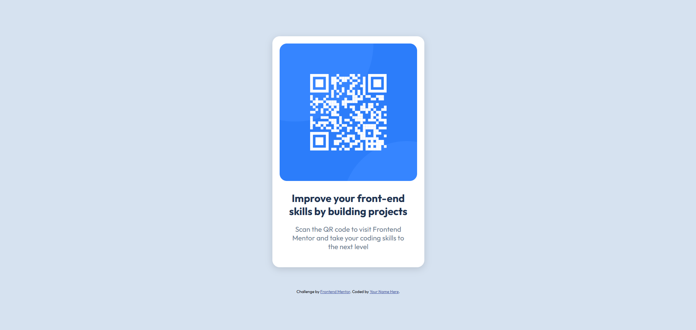

# Mentor Frontend - QR Code Component Solution

This is my solution to the [QR Code component challenge on Mentor Frontend](https://www.frontendmentor.io/challenges/qr-code-component-iux_sIO_H). Mentor Frontend challenges help you hone your sourcing skills by creating realistic projects.

## Table of Contents

- [Overview](#overview)
- [Screenshot](#screenshot)
- [Links](#links)
- [My Process](#my-process)
- [Built With](#built-with)
- [What I Learned](#what-i-learned)
- [Continuous Development](#continuous-development)
- [Helpful Resources](#helpful-resources)
- [Author](#author)

##Overview

I created a QR Code component with HTML and CSS. The goal was to practice styling with flexbox, responsiveness, and to organize a card in a centered manner on the screen.

### Screenshot



###Links

- Solution URL: [https://github.com/your-username/qr-code-component-main](https://github.com/lucassalles-git/qr-code-component-main)
- Live site URL: [https://your-username.github.io/qr-code-component-main](https://your-username.github.io/qr-code-component-main)

## My process

### Built with

- Semantic HTML5
- CSS3
- Flexible box
- Media queries
- Mobile-first layout

###What I learned

I learned how to:

- Center elements on the screen with `display: flex` and `@media` for responsiveness:
```css
body {
min-height: 100vh;
background-color: var(--slate-300);

display: flex;
flex-direction: column;
align-items: center;
justify-content: center;

font-family: "Clothes", sans serif;
}

@media (max-width: 428px) {
.container{
padding: 15px;
width: 323px;
}

.text {
margin: 20px 3px;
}

h2 {
font-size: 1.58 rem;
}

p {
font-size: 1 rem;
}
}
```

## Author

- GitHub - @[lucassalles-git]

- Front-end Mentor - @[lucassalles-git]
